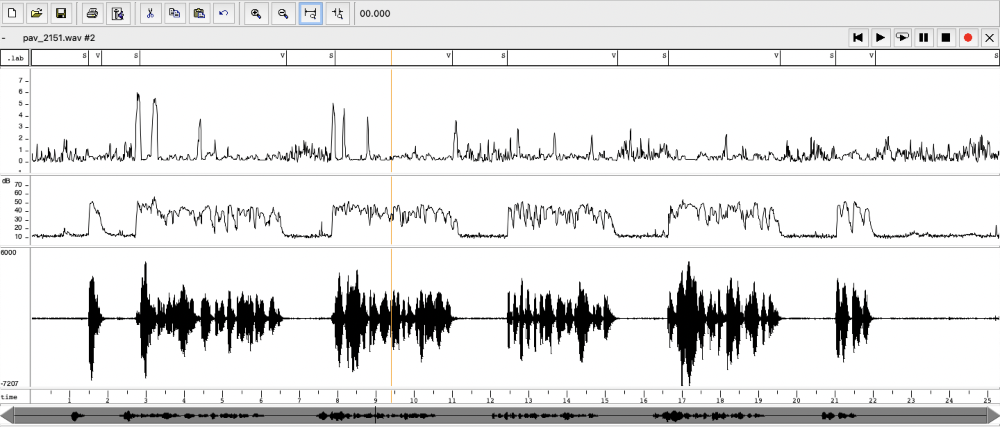
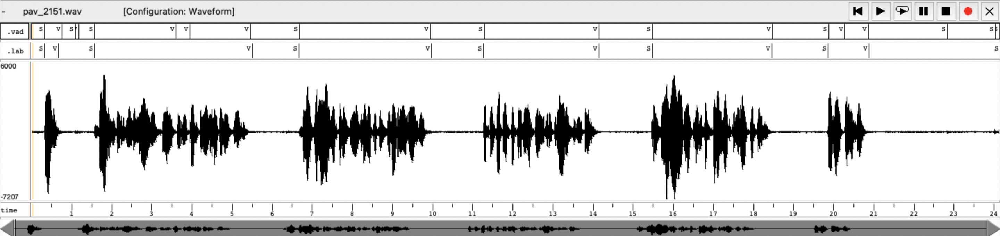
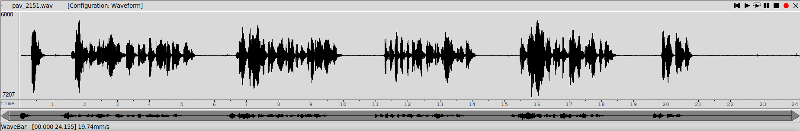
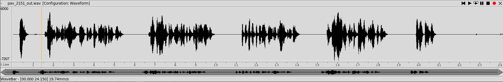
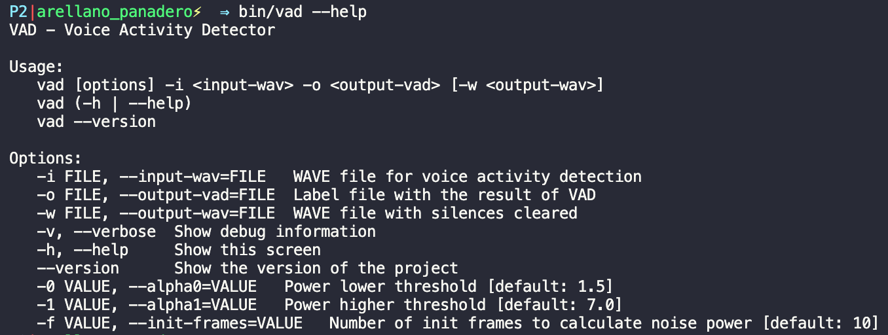

PAV - P2: detección de actividad vocal (VAD)
============================================

Esta práctica se distribuye a través del repositorio GitHub [Práctica 2](https://github.com/albino-pav/P2),
y una parte de su gestión se realizará mediante esta web de trabajo colaborativo.  Al contrario que Git,
GitHub se gestiona completamente desde un entorno gráfico bastante intuitivo. Además, está razonablemente
documentado, tanto internamente, mediante sus [Guías de GitHub](https://guides.github.com/), como
externamente, mediante infinidad de tutoriales, guías y vídeos disponibles gratuitamente en internet.


Inicialización del repositorio de la práctica.
----------------------------------------------

Para cargar los ficheros en su ordenador personal debe seguir los pasos siguientes:

*	Abra una cuenta GitHub para gestionar esta y el resto de prácticas del curso.
*	Cree un repositorio GitHub con el contenido inicial de la práctica (sólo debe hacerlo uno de los
	integrantes del grupo de laboratorio, cuya página GitHub actuará de repositorio central del grupo):
	-	Acceda la página de la [Práctica 2](https://github.com/albino-pav/P2).
	-	En la parte superior derecha encontrará el botón **`Fork`**. Apriételo y, después de unos segundos,
		se creará en su cuenta GitHub un proyecto con el mismo nombre (**P2**). Si ya tuviera uno con ese 
		nombre, se utilizará el nombre **P2-1**, y así sucesivamente.
*	Habilite al resto de miembros del grupo como *colaboradores* del proyecto; de este modo, podrán
	subir sus modificaciones al repositorio central:
	-	En la página principal del repositorio, en la pestaña **:gear:`Settings`**, escoja la opción 
		**Collaborators** y añada a su compañero de prácticas.
	-	Éste recibirá un email solicitándole confirmación. Una vez confirmado, tanto él como el
		propietario podrán gestionar el repositorio, por ejemplo: crear ramas en él o subir las
		modificaciones de su directorio local de trabajo al repositorio GitHub.
*	En la página principal del repositorio, localice el botón **Branch: master** y úselo para crear
	una rama nueva con los primeros apellidos de los integrantes del equipo de prácticas separados por
	guion (**fulano-mengano**).
*	Todos los miembros del grupo deben realizar su copia local en su ordenador personal.
	-	Copie la dirección de su copia del repositorio apretando en el botón **Clone or download**.
		Asegúrese de usar *Clone with HTTPS*.
	-	Abra una sesión de Bash en su ordenador personal y vaya al directorio **PAV**. Desde ahí, ejecute:

		```.sh
		git clone dirección-del-fork-de-la-práctica
		```

	-	Vaya al directorio de la práctica `cd P2`.
	-	Añada la etiqueta `origin` a su copia del repositorio. Esto es útil para facilitar los *push* y
		*pull* al repositorio original:
		```.sh
		git remote add origin dirección-del-fork-de-la-práctica
		```
	-	Cambie a la rama **fulano-mengano** con la orden:

		```.sh
		git checkout fulano-mengano
		```

*	A partir de este momento, todos los miembros del grupo de prácticas pueden trabajar en su directorio
	local del modo habitual.
	-	También puede utilizar el repositorio remoto como repositorio central para el trabajo colaborativo
		de los distintos miembros del grupo de prácticas; o puede serle útil usarlo como copia de
		seguridad.
	-	Cada vez que quiera subir sus cambios locales al repositorio GitHub deberá confirmar los
		cambios en su directorio local:

		```.sh
		git add .
		git commit -m "Mensaje del commit"
		```

		y, a continuación, subirlos con la orden:

		```.sh
		git push -u origin fulano-mengano
		```

*	Al final de la práctica, la rama **fulano-mengano** del repositorio GitHub servirá para remitir la
	práctica para su evaluación utilizando el mecanismo *pull request*.
	-	Vaya a la página principal de la copia del repositorio y asegúrese de estar en la rama
		**fulano-mengano**.
	-	Pulse en el botón **New pull request**, y siga las instrucciones de GitHub.


Entrega de la práctica.
-----------------------

Responda, en este mismo documento (README.md), los ejercicios indicados a continuación. Este documento es
un fichero de texto escrito con un formato denominado _**markdown**_. La principal característica de este
formato es que, manteniendo la legibilidad cuando se visualiza con herramientas en modo texto (`more`,
`less`, editores varios, ...), permite amplias posibilidades de visualización con formato en una amplia
gama de aplicaciones; muy notablemente, **GitHub**, **Doxygen** y **Facebook** (ciertamente, :eyes:).

En GitHub. cuando existe un fichero denominado README.md en el directorio raíz de un repositorio, se
interpreta y muestra al entrar en el repositorio.

Debe redactar las respuestas a los ejercicios usando Markdown. Puede encontrar información acerca de su
sintáxis en la página web [Sintaxis de Markdown](https://daringfireball.net/projects/markdown/syntax).
También puede consultar el documento adjunto [MARKDOWN.md](MARKDOWN.md), en el que se enumeran los
elementos más relevantes para completar la redacción de esta práctica.

Recuerde realizar el *pull request* una vez completada la práctica.

Ejercicios
----------

### Etiquetado manual de los segmentos de voz y silencio

- Etiquete manualmente los segmentos de voz y silencio del fichero grabado al efecto. Inserte, a 
  continuación, una captura de `wavesurfer` en la que se vea con claridad la señal temporal, el contorno de
  potencia y la tasa de cruces por cero, junto con el etiquetado manual de los segmentos.
  


- A la vista de la gráfica, indique qué valores considera adecuados para las magnitudes siguientes:

	* Incremento del nivel potencia en dB, respecto al nivel correspondiente al silencio inicial, para
	  estar seguros de que un segmento de señal se corresponde con voz.
	  
	  En el caso de la potencia se diferencian bastante bien a lo largo de toda la señal los tramos de silencio y de voz. Utilizando el audio *pav_2151.wav*, podríamos utilizar 30dBs como umbral, ya que a lo largo de la señal los tramos de silencio no superan este valor. No obstante, imponer un mismo umbral para todas las potencias no es la mejor opción, por lo que finalmente hemos optado por realizar la media de las primeras tramas (que se consideran silencio) para así poder personalizar el estudio para cada señal.

	* Duración mínima razonable de los segmentos de voz y silencio.
	
		En el segmento grabado se han exagerado excesivamente las pausas entre frases, por lo que decidimos comparar los resultados obtenidos con otros audios de la base de datos, llegando a la conclusión de que los tramos de silencio no suelen durar menos de 0,3s (En nuestra señal, todos los silencios son superiores a 0,5s). Los segmentos de voz tienen duración más variable, debido a la longitud de la frase o palabra que se pronuncie. En nuestro caso, el segmento de voz más corto es de 0,5s y corresponde a la palabra *Hola*. No obstante, todos los demás tramos de voz duran aproximadamente 3s.

	* ¿Es capaz de sacar alguna conclusión a partir de la evolución de la tasa de cruces por cero?
	
		No podemos llegar a ninguna conclusión a partir de la evolución de la tasa de cruces por cero, aunque puede ser útil para acabar de tomar una decisión. En los tramos sordos la zcr suele oscilar alrededor del 2. Cabe destacar que justo al empezar un tramo de voz (y en algunos casos al empezar a pronunciar una palabra), la zcr crece notablemente, pudiéndonos llevar a confusión. Por tanto, únicamente son útiles para acabar de perfeccionar el autómata.

### Desarrollo del detector de actividad vocal

- Complete el código de los ficheros de la práctica para implementar un detector de actividad vocal tan
  exacto como sea posible. Tome como objetivo la maximización de la puntuación-F `TOTAL`.
  
  Tras implementar el autómata con los cuatro estados, hemos conseguido una precisión de 98,451% en nuestra señal y un 93,913% en el conjunto de señales de la base de datos.

```bash
**************** pav_2151.lab ****************
Recall V: 14.31/14.48  98.80%   Precision V: 14.31/14.51  98.60%   F-score V (2)  : 98.76%
Recall S:  9.47/9.67   97.90%   Precision S:  9.47/9.64   98.20%   F-score S (1/2): 98.14%
===> pav_2151.lab: 98.451%
```
```bash
**************** Summary ****************
Recall V:370.56/382.74 96.82%   Precision V:370.56/413.50 89.61%   F-score V (2)  : 95.29%
Recall S:228.07/271.01 84.15%   Precision S:228.07/240.25 94.93%   F-score S (1/2): 92.56%
===> TOTAL: 93.913%
```


- Inserte una gráfica en la que se vea con claridad la señal temporal, el etiquetado manual y la detección
  automática conseguida para el fichero grabado al efecto. 

	

- Explique, si existen, las discrepancias entre el etiquetado manual y la detección automática.

	Aunque en general son bastante parecidos, al principio del audio hay un pequeño instante en el que en medio de un silencio laargo  detetcta voz. Hay pequeños errores de precisión (tanto a la hora de etiquetar manualmente como al detectarlo), a penas apreciables (0,05s), justo en los cambios entre voz y silencio.

	Además hay que destacar,  que a  diferencia del etiquetado manual, la detección automática genera varias etiquetas seguidas de un mismo tipo de trama. Esto se debe a haber eliminado los *glitches*, saltos breves de voz a silencio y viceversa.

- Evalúe los resultados sobre la base de datos `db.v4` con el script `vad_evaluation.pl` e inserte a 
  continuación las tasas de sensibilidad (*recall*) y precisión para el conjunto de la base de datos (sólo
  el resumen).

	Tal y como se ha indicado en el primer ejercicio, tras haber probado diferentes algoritmos en el autómata, el mejor resultado conseguido se ha conseguido implementando los cuatro estados.

	```bash
	**************** Summary ****************
	Recall V:370.56/382.74 96.82%   Precision V:370.56/413.50 89.61%   F-score V (2)  : 95.29%
	Recall S:228.07/271.01 84.15%   Precision S:228.07/240.25 94.93%   F-score S (1/2): 92.56%
	===> TOTAL: 93.913%
	```

### Trabajos de ampliación

#### Cancelación del ruido en los segmentos de silencio

- Si ha desarrollado el algoritmo para la cancelación de los segmentos de silencio, inserte una gráfica en
  la que se vea con claridad la señal antes y después de la cancelación (puede que `wavesurfer` no sea la
  mejor opción para esto, ya que no es capaz de visualizar varias señales al mismo tiempo).

	A continuación podemos observar la señal original:
	

	A continuación podemos observar la señal modificada añadiendo ceros en las tramas detectadas como silencios:
	

	Visualmente, podemos concluir que el autómata funciona correctamente, ya que en la mayoría de tramos de la señal original donde realmente había silencios se han modificado y ahora toman el valor de cero.

#### Gestión de las opciones del programa usando `docopt_c`

- Si ha usado `docopt_c` para realizar la gestión de las opciones y argumentos del programa `vad`, inserte
  una captura de pantalla en la que se vea el mensaje de ayuda del programa.

  
En el programa de ayuda se ha añadido la opción de introducir dos umbrales. Alpha0 corresponde al valor máximo para que la voz pase a ser considerada como silencio, mientras que Alpha1 es el mínimo valor para  pasar de silencio a voz.

Además, se ha añadido la opción de elegir el número de tramas que se utilizan para obtener la potencia media del ruido de la señal.

### Contribuciones adicionales y/o comentarios acerca de la práctica

- Indique a continuación si ha realizado algún tipo de aportación suplementaria (algoritmos de detección o 
  parámetros alternativos, etc.).

  Hemos considerado la opción de que el usuario pueda introducir el número de tramas que se utilizan para obtener la potencia media del ruido de la señal ya que hemos observado que en algunas señales que son más ruidosas el resultado mejora notablemente al aummentar el número de tramas consideradas (por ejemplo, a 12 o 14 tramas), mientras que si la señal tiene un ruido muy plano, con menos tramas es suficiente (8 tramas). Por defecto hemos decidido dejar el valor intermedio.

- Si lo desea, puede realizar también algún comentario acerca de la realización de la práctica que
  considere de interés de cara a su evaluación.

	Hemos decidido incluir el parámetro de la tasa de cruces por cero en la evaluación de la señal para consseguir un autómata más completo y preciso. No obstante, esta mejora a veces juega en contra, ya que sin considerarlo, llegamos a conseguir un resultado de 93,982% con las señales de la base de datos, aunque en nuestra señal particular y otras estudiadas, la mejora es más perceptible.

	En las líneas 88-92 del fichero main_vad.c se han implementado unas relaciones que a primera vista pueden parecer incoherentes. No obstante, tras programar las asignaciones del revés (si es MB_VOICE, asignarlo a VOICE, y si es MB_SILENCE, asignarlo a SILENCE), obtuvimos un resultado mucho menor que al implementarlo de la manera "*incoherente*".


### Antes de entregar la práctica

Recuerde comprobar que el repositorio cuenta con los códigos correctos y en condiciones de ser 
correctamente compilados con la orden `meson bin; ninja -C bin`. El programa generado (`bin/vad`) será
el usado, sin más opciones, para realizar la evaluación *ciega* del sistema.
